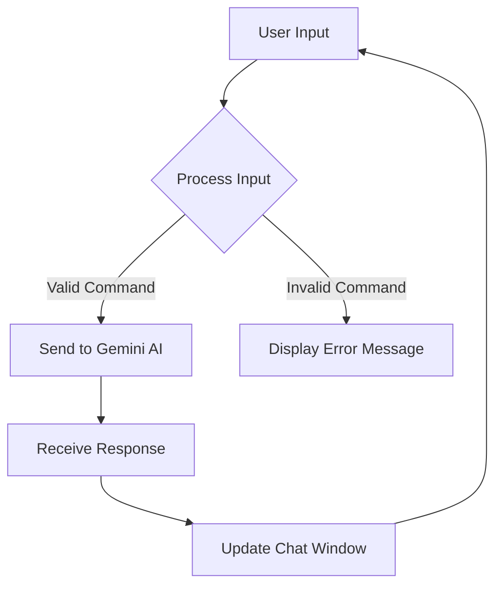

# 🏰 Text Adventure Game with Gemini 1.5 Flash

Welcome to the **Text Adventure Game**! This project is a fun and interactive text-based adventure game that utilizes the **Gemini 1.5 Flash** model as the game master. Players can type commands and interact with the game world, while Gemini generates responses to guide the adventure.

## 📜 Project Description

This project aims to recreate the nostalgic experience of classic text adventure games, where players navigate through a fantasy world using text commands. The game leverages the power of the Gemini AI to provide dynamic storytelling and responses, making each playthrough unique.

## ✨ Features

- **Interactive Gameplay**: Players can type commands to interact with the game world.
- **Dynamic Responses**: The Gemini AI generates responses based on player input, creating a rich narrative experience.
- **Dungeons & Dragons Theme**: The interface is designed to evoke the feel of classic D&D adventures, complete with a parchment-like background and retro fonts.
- **User-Friendly Interface**: A clean and intuitive layout that allows players to focus on the adventure.

## 📦 Installation

To get started with the Text Adventure Game, follow these steps:

1. **Clone the Repository**:
   ```bash
   git clone https://github.com/yourusername/text-adventure-game.git
   cd text-adventure-game
   ```

2. **Install Dependencies**:
   Make sure you have Node.js installed, then run:
   ```bash
   npm install
   ```

3. **Set Up Environment Variables**:
   Create a `.env` file in the root directory of the backend and add your API key:
   ```plaintext
   API_KEY=your_google_api_key
   ```

4. **Start the Backend Development Server**:
   ```bash
   cd backend
   npm start
   ```

5. **Open Your Browser**:
   Navigate to `http://localhost:3000` to start playing!

6. **On Push Pipeline Deploy**:

   `https://eldoria.quest/`
   `https://675c9fa70d7e30007a348d54--remarkable-puffpuff-72e975.netlify.app/`

   https://app.netlify.com/teams/wirelessjava2002/

## 🎮 Usage

Once the application is running, you can start your adventure by typing commands into the input box at the bottom of the screen. The game will respond with text-based narratives and options based on your input.

### Example Commands:
- `look around`
- `go north`
- `take sword`
- `talk to the wizard`

## 📊 Application Flow




## 🛠️ Technologies Used

- **React**: For building the user interface.
- **Axios**: For making HTTP requests to the backend.
- **Gemini 1.5 Flash**: The AI model used for generating game responses.
- **CSS**: For styling the application with a D&D theme.

## 🤝 Contributing

Contributions are welcome! If you have suggestions for improvements or new features, please open an issue or submit a pull request.

## 📄 License


This project is licensed under the MIT License. See the [LICENSE](LICENSE) file for details.

## 📫 Contact

For any inquiries, please reach out.
---

Happy adventuring! May your quests be filled with excitement and discovery! 🧙‍♂️✨


Example Dialogue:

GM: The moan intensifies, a chilling wail that seems to emanate from the very stones themselves. A shadowy figure begins to take shape within the mist.
User: talk to figure
GM: The figure materializes fully, revealing a gaunt specter with eyes burning like embers. It speaks in a voice like rustling bones, "You have trespassed upon sacred ground."
User: im sorry
GM: The specter's gaze chills you to the bone, but its wrath seems to lessen slightly. Perhaps there is a way to appease this ancient guardian.
User: i can tell a joke, the specter may like it
GM: The specter lets out a rattling chuckle, a sound like stones grinding together. Perhaps humor can bridge even the gap between the living and the spectral realm.
User: whats brown and sticky
GM: The specter tilts its skeletal head, a flicker of something akin to amusement in its burning eyes. "I'll give you one guess, mortal."
User: a stick?
GM: The specter bursts into a cacophony of rattling laughter, a sound both chilling and strangely mirthful. "Indeed, mortal! You have proven yourself worthy." 200 experience points

## CloudFlare
https://dash.cloudflare.com/449673cb461c601e0b4ec900e4d0fecc/ai/workers-ai
add to .env file under backend folder
CLOUDFLARE_API_TOKEN=your_token_here
CLOUDFLARE_ACCOUNT_ID=your_cloudflare_account_id